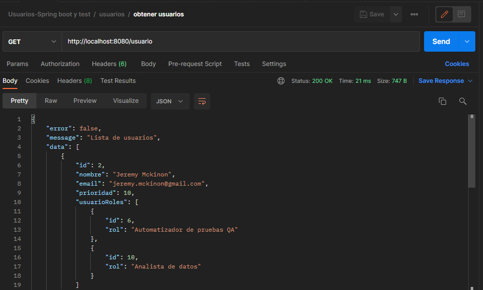
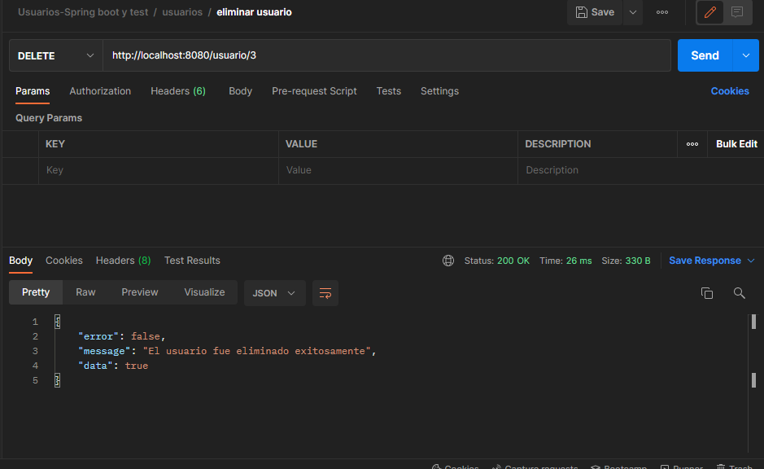
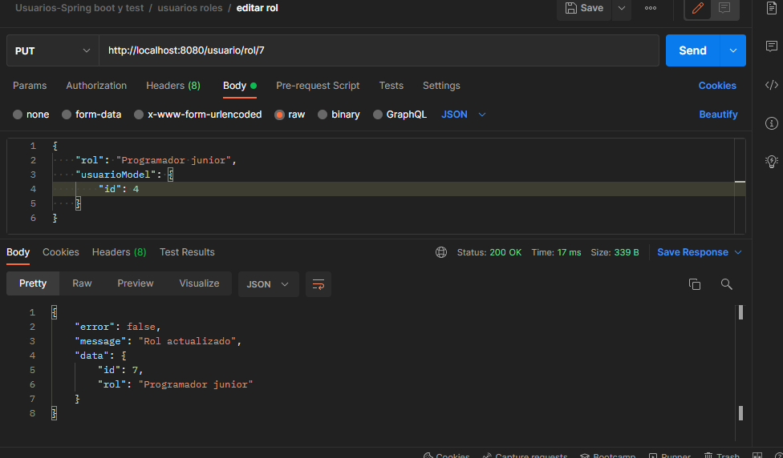
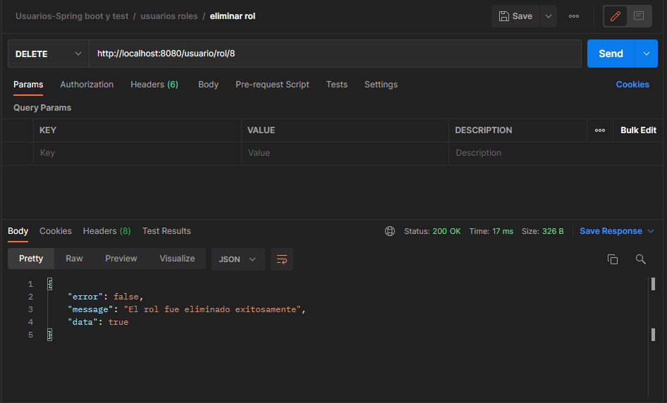

# Práctica de CRUD
+ Spring Boot
+ JPA
+ MySQL
+ Unit testing

# Instrucciones del programa
1. Clone el repositorio 
+ git clone https://github.com/tattortega/demoCrudTEST
2. Ejecute la clase principal
+ Run 'DemocrudApplication'
3. Siga a continuación las rutas de acceso.

# Rutas de acceso

### Index
+ localhost:8080/

### GET
+ /usuario 
+ /usuario/{id} 
+ /usuario/query?priority=? 
+ /usuario/rol 
+ /usuario/rol/{id} 
+ /usuario/rol/query?rol=?

### POST
+ /usuario 
+ /usuario/rol

### DELETE
+ /usuario/{id} 
+ /usuario/rol/{id}

### PUT
+ /usuario/{id} 
+ /usuario/rol/{id}

## Relación entre tablas
Para las tablas Usuario y Rol, elegí la relación @OneToMany ya que asi se solicitaba en el ejercicio.

## Evidencia del CRUD en Postman
    @Get Usuario

    @Get id Usuario

    @Get query Usuario

    @Post Usuario

    
    @Put Usuario

    @Delete Usuario

    @Get Rol

    @Get id Rol

    @Get query Rol

    @Post UsuarioRol

    @Put Rol

    @Delete Rol

## Desarrollador
+ Ricardo Ortega - tattortega.28@gmail.com
